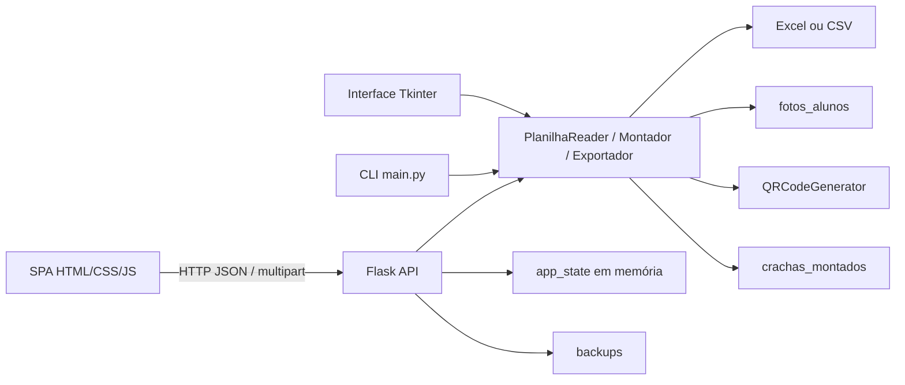

# Auditoria funcional completa — Cara-Crachá

**Data:** 23/09/2026  
**Escopo:** interface web, interface Tkinter, CLI, API Flask, regras de geração, importação, exportação, armazenamento em arquivos, acessibilidade, responsividade e testes.  
**Método:** duas passagens independentes, inspeção estática, execução dos testes existentes, 25 cenários de API em diretórios temporários, verificação do servidor ativo e comparação entre a planilha e os arquivos gerados.

## 1. Resumo executivo

A função central funciona: o sistema lê a planilha, lista alunos, encontra fotos, gera crachás com QR baseado no código oficial e exporta PDF por turma. Os 42 testes existentes passaram e os 25 cenários adicionais de API retornaram os status esperados.

A resposta à pergunta de conclusão é **não**: nem todos os controles cumprem integralmente o comportamento anunciado. Foram confirmados quatro controles quebrados, sete botões parcialmente funcionais, ausência de teste E2E da interface e problemas de integridade, segurança e persistência.

Principais achados:

1. **ALTO — injeção de HTML/JavaScript no frontend:** dados vindos de planilhas são interpolados em `innerHTML` e em atributos inline sem escape consistente. Uma planilha de teste com `` foi devolvida pela API sem neutralização e seria interpretada pelo navegador nas tabelas.
2. **ALTO — backup incompleto:** o botão “Backup” copia somente `TurmaCrachas` e `static`; não inclui `alunosiema.xlsx`, `fotos_alunos`, `crachas_montados`, configurações ou uploads. A mensagem de sucesso cria uma expectativa incorreta de proteção dos dados operacionais.
3. **ALTO — saída sem reconciliação:** a planilha atual contém 441 alunos, enquanto há 440 crachás individuais. A turma 102 possui arquivos faltantes e um arquivo obsoleto. A geração sobrescreve arquivos correspondentes, mas não remove saídas antigas nem mantém manifesto.
4. **MÉDIO — “Cor de destaque” não funciona:** duas imagens geradas com `#FF0000` e `#00FF00` ficaram byte a byte visualmente idênticas. O valor chega ao backend, mas o montador usa cores fixas.
5. **MÉDIO — “Preview” na tela Gerar pode não fazer nada:** o botão chama `gerarPreview()` sem escolher aluno nem levar o usuário à tela de visualização. Quando o seletor está vazio, a função retorna sem feedback.
6. **MÉDIO — “Cancelar importação” não cancela:** a API e o estado do frontend já são atualizados durante o preview. O botão apenas esconde a área e limpa o campo de arquivo.
7. **MÉDIO — estado global volátil:** alunos ficam em `app_state` na memória. Reiniciar o servidor perde a seleção da planilha; múltiplos usuários compartilhariam o mesmo estado caso o servidor fosse exposto na rede.
8. **MÉDIO — acessibilidade incompleta:** modal sem `role="dialog"`, sem ESC, foco preso ou restauração; controles visuais ocultam radios e checkboxes com `display:none`; botões somente com ícone não têm nome acessível; menu mobile não expõe `aria-expanded`.

Não foi encontrada falha **crítica** confirmada. Há três achados altos, nove médios e oito baixos ou de manutenção.

## 2. Arquitetura funcional encontrada



- **Frontend:** SPA sem roteador; as telas são seções alternadas por classe CSS.
- **Backend:** Flask com 16 rotas, sendo 13 endpoints de API e 3 rotas de arquivos/frontend.
- **Persistência:** planilhas e arquivos locais. Não existe banco de dados, ORM, repository, transaction ou migration.
- **Estado:** lista de alunos e turmas em memória global do processo.
- **Autenticação/autorização:** inexistente. O padrão `127.0.0.1` reduz exposição, mas `--host` permite publicação sem proteção.
- **Integrações externas:** somente Google Fonts no frontend; não há API de negócio externa, webhook, fila ou job.

## 3. Indicadores objetivos

| Indicador | Resultado | Critério |
|---|---:|---|
| Elementos `<button>` estáticos | 23 | Contagem no HTML |
| Controles interativos estáticos | 38 | Botões, inputs e selects |
| Padrões de ação, incluindo dinâmicos | 45 | Inclui linhas de aluno, galeria, modal e drag/drop |
| Botões totalmente funcionais | 14/23 | Evento, resultado e feedback adequados |
| Botões parciais | 7/23 | Resultado incompleto, enganoso ou inacessível |
| Botões quebrados | 2/23 | Cancelar importação e Preview da tela Gerar |
| Ações completamente operacionais | 29/45 | Base da cobertura funcional |
| Ações parciais | 11/45 | Inclui acessibilidade e feedback |
| Ações quebradas | 4/45 | Dois botões e dois controles de cor |
| Ação anunciada e ausente | 1/45 | Clique na zona de upload anunciada no texto |
| Rotas HTTP executadas | 16/16 | 100% responderam conforme método esperado |
| APIs com contrato HTTP válido | 13/13 | 100% alcançáveis |
| APIs com comportamento integral | 7/13 | 53,8%; demais têm lacunas de regra/integração |
| Testes existentes | 42/42 | 100% passando |
| Cenários adicionais de API | 25/25 | 100% com status esperado |
| Testes E2E de navegador | 0 | Nenhum Playwright/Cypress/Selenium |

**COBERTURA FUNCIONAL:** **64,4%** (29 ações completas / 45 identificadas)  
**CRUD COMPLETO:** **25%** (somente leitura é completa; criação é importação volátil, atualização e exclusão não existem)  
**ROTAS FUNCIONAIS:** **100%** no nível HTTP  
**APIs FUNCIONAIS:** **53,8%** integralmente; **100%** alcançáveis  
**INTEGRAÇÕES FUNCIONAIS:** **N/A**, nenhuma integração de negócio externa  
**TESTES FUNCIONAIS E2E:** **0%**; taxa de aprovação unitária/integração existente: **100%**

## 4. Inventário de menus e matriz menu → funcionalidade

| ID | Menu/tela | Ação | Handler | API/serviço | Persistência | Status |
|---|---|---|---|---|---|---|
| M01 | Dashboard | Abrir Dashboard | `mudarAba` | `GET /api/diagnostico` | Leitura de arquivos | ✅ OK |
| M02 | Importar Dados | Abrir tela | `mudarAba` | — | — | ✅ OK |
| M03 | Carregar IEMA | Carregar base padrão | `carregarDadosIEMA` | `POST /api/planilha-padrao`, `GET /api/alunos` | Memória | ✅ OK |
| M04 | Alunos | Listar alunos | `mudarAba`, `renderizarAlunos` | Dados já carregados | Memória | ✅ OK |
| M05 | Configurar | Alterar formato/foto/QR/cor | handlers locais | Payload de geração | Memória do navegador | ⚠️ Parcial: cor ignorada |
| M06 | Gerar Crachás | Gerar e filtrar | `gerarCrachas`, `filtrarGeracaoPorTurma` | `POST /api/gerar`, `GET /api/crachas` | Arquivos | ✅ Principal funcional |
| M07 | Visualizar | Gerar preview | `gerarPreview` | `POST /api/gerar/preview` | Sem persistência | ✅ OK |
| M08 | Diagnóstico | Exibir estrutura | `abrirDiagnostico` | `GET /api/diagnostico` | Leitura | ⚠️ Turmas vêm de pasta legada vazia |
| M09 | Backup | Criar cópia | `fazerBackup` | `POST /api/backup` | Arquivos | ⚠️ Backup incompleto |

Matriz resumida:

```text
Dashboard
├── Importar Planilha → mudarAba('importar')
├── Carregar IEMA → POST /api/planilha-padrao → app_state
├── Baixar Modelo → GET /api/baixar-exemplo → arquivo XLSX
├── Gerar Todos → somente abre a tela Gerar
└── Diagnóstico → GET /api/diagnostico → modal

Importar Dados
├── Selecionar/soltar planilha → POST /api/planilha/colunas → app_state
├── Confirmar → GET /api/alunos → STATE.alunos
├── Cancelar → apenas oculta a área (estado permanece)
└── Importar fotos → POST /api/fotos → fotos_alunos

Alunos
├── Buscar/filtrar → filtro local
├── Selecionar individual/todos → Set por nome
└── Visualizar → POST /api/gerar/preview

Configurar
├── Formato → usado por POST /api/gerar
├── Mostrar foto/QR → usado por geração e preview
└── Cor → enviada, mas não aplicada pelo MontadorCracha

Gerar Crachás
├── Filtrar turma → STATE + GET /api/crachas?turma=
├── Gerar → POST /api/gerar → crachas_montados/<turma>
├── Preview → depende de seletor de outra tela; falha silenciosa
└── Exportar PDF → POST /api/exportar-pdf-turma → PDF A4

Visualizar
└── Selecionar aluno → POST /api/gerar/preview → data URI PNG
```

## 5. Inventário dos 23 botões web

| ID | Tela | Botão | Handler | Resultado esperado | Status |
|---|---|---|---|---|---|
| B01 | Sidebar | Dashboard | `mudarAba` | Mostrar dashboard | ✅ |
| B02 | Sidebar | Importar Dados | `mudarAba` | Mostrar importação | ✅ |
| B03 | Sidebar | Carregar IEMA | `carregarDadosIEMA` | Carregar base e listar | ✅ |
| B04 | Sidebar | Alunos | `mudarAba` | Mostrar lista | ✅ |
| B05 | Sidebar | Configurar | `mudarAba` | Mostrar opções | ✅ |
| B06 | Sidebar | Gerar Crachás | `mudarAba` | Mostrar geração | ✅ |
| B07 | Sidebar | Visualizar | `mudarAba` | Mostrar preview | ✅ |
| B08 | Sidebar | Diagnóstico | `abrirDiagnostico` | Diagnóstico confiável | ⚠️ |
| B09 | Sidebar | Backup | `fazerBackup` | Proteger dados operacionais | ⚠️ |
| B10 | Topbar | Menu mobile | `toggleSidebar` | Abrir/fechar menu | ⚠️ Sem ARIA/ESC |
| B11 | Dashboard | Importar Planilha | `mudarAba` | Abrir importação | ✅ |
| B12 | Dashboard | Carregar Dados IEMA | `carregarDadosIEMA` | Carregar base | ✅ |
| B13 | Dashboard | Baixar Modelo Excel | `baixarExemplo` | Download com confirmação real | ⚠️ Sucesso é anunciado antes da resposta |
| B14 | Dashboard | Gerar Todos os Crachás | `mudarAba` | Nome sugere gerar; somente navega | ⚠️ |
| B15 | Dashboard | Diagnóstico | `abrirDiagnostico` | Mesmo B08 | ⚠️ |
| B16 | Importar | Selecionar Arquivo | `fileInput.click` | Selecionar planilha | ✅ |
| B17 | Importar | Confirmar Importação | `confirmarImportacao` | Consolidar lista | ✅ |
| B18 | Importar | Cancelar | `cancelarImportacao` | Desfazer importação | 💥 Quebrado |
| B19 | Importar | Selecionar Fotos | `fotosInput.click` | Enviar fotos | ✅ |
| B20 | Gerar | Gerar Crachás | `gerarCrachas` | Gerar seleção | ✅ |
| B21 | Gerar | Preview | `gerarPreview` | Exibir preview da seleção | 💥 Quebrado no fluxo comum |
| B22 | Gerar | Exportar PDF da Turma | `exportarPdfTurma` | PDF A4 da turma | ✅ |
| B23 | Modal | × | `fecharModal` | Fechar modal | ⚠️ Sem nome acessível/gestão de foco |

## 6. Outros controles interativos

- **Funcionais:** busca de aluno, filtro de turma da lista, filtro da geração, seleção de formato, seletor de aluno para preview, cards da galeria, link para baixar PDF novamente, upload múltiplo de fotos, drag/drop da planilha e clique fora do modal.
- **Parciais:** seleção por nome em vez de código; “selecionar todos” sem rótulo acessível; toggles ocultos por `display:none`; alterações de foto/QR não atualizam automaticamente um preview aberto.
- **Quebrados:** seletor de cor e campo hexadecimal, pois `ConfiguracaoCracha.cor_destaque` não é usado pelo montador.
- **Fantasma:** o texto “clique para selecionar” sugere que toda a zona de upload é clicável, mas somente o botão interno abre o seletor.

## 7. Rastreamento dos fluxos críticos

### Gerar crachá

`B20` → `gerarCrachas()` → `POST /api/gerar` → filtra turma/nomes → valida códigos QR → `MontadorCracha.montar()` → `FotoHandler.buscar_foto_aluno()` + `QRCodeGenerator.gerar_para_aluno()` → `ExportadorCracha` → arquivo local → JSON → toast, lista e dashboard.

Resultado: funcional, com três ressalvas: geração não transacional, progresso simulado e arquivos antigos não reconciliados.

### Exportar PDF da turma

`B22` → `exportarPdfTurma()` → `POST /api/exportar-pdf-turma` → valida turma/códigos → monta 10 crachás por A4 → grava temporário → substitui PDF final → download → feedback.

Resultado: funcional e com gravação atômica do PDF final.

### Importar planilha

Arquivo/drop → `processarArquivo()` → `POST /api/planilha/colunas` → arquivo temporário UUID → `PlanilhaReader` → `app_state` já é alterado → preview → Confirmar apenas consulta `/api/alunos`.

Resultado: importação funciona, mas “preview/confirmar/cancelar” não forma uma transação real.

### Importar fotos

`B19` → lotes de 20 → `POST /api/fotos` → valida imagem PIL → `secure_filename` → grava em `fotos_alunos` → feedback.

Resultado: funcional; arquivo com o mesmo nome é sobrescrito sem confirmação, versão ou relatório de conflito.

## 8. APIs e rotas

| Método e rota | Consumidor | Teste | Estado |
|---|---|---|---|
| GET `/` | Navegador | 200 | ✅ |
| GET `/static/<path>` | Navegador | 200 | ✅ |
| GET `/crachas/<path>` | Galeria/download | 200 e travessia bloqueada pelo Flask | ✅ |
| GET `/api/health` | Health check | 200 | ✅ |
| POST `/api/fotos` | Upload de fotos | 200 válido / 400 inválido | ⚠️ sobrescrita silenciosa |
| POST `/api/planilha-padrao` | Carregar IEMA | 200 | ✅ |
| GET `/api/diagnostico` | Dashboard/modal | 200 | ⚠️ fonte de turmas legada |
| POST `/api/planilha/colunas` | Importação | 200 / 400 extensão | ⚠️ dados exigem escape no frontend |
| GET `/api/alunos` | Confirmação | 200 e filtros | ✅ |
| POST `/api/gerar` | Geração | 200 / 400 | ⚠️ cor ignorada e lote não atômico |
| POST `/api/exportar-pdf-turma` | PDF | 200 / 400 / 404 | ⚠️ cor ignorada |
| POST `/api/gerar/preview` | Preview | 200 / 400 / 404 | ⚠️ cor ignorada |
| POST `/api/backup` | Backup | 200 | ⚠️ escopo incompleto |
| POST `/api/exemplo` | Nenhum frontend | 200 | 🧟 endpoint órfão |
| GET `/api/baixar-exemplo` | Download | 200 | ✅ API; feedback frontend parcial |
| GET `/api/crachas` | Galeria | 200 e filtro | ✅ |

Não foram encontradas rotas inexistentes usadas pelo frontend. Não há middleware de autenticação, autorização, CSRF, rate limit ou auditoria de usuário.

## 9. CRUD e persistência

| Recurso | Create | Read | Update | Delete | Classificação |
|---|---|---|---|---|---|
| Alunos | Importação em memória | Lista/filtro | Ausente | Ausente | PARCIAL |
| Fotos | Upload | Uso na montagem | Sobrescrita implícita | Ausente | PARCIAL |
| Crachás | Geração | Galeria/download | Regeneração/sobrescrita | Ausente | PARCIAL |
| PDFs de turma | Geração | Download | Regeneração atômica | Ausente | PARCIAL |
| Backup | Criação | Pasta local | Ausente | Ausente | PARCIAL e incompleto |

Não existe banco. Portanto, INSERT/UPDATE/DELETE, constraints, foreign keys e transactions de banco são **não aplicáveis**. A consistência depende do filesystem e de estado em memória.

## 10. Segurança e permissões

### SEC-01 — DOM XSS por dados importados — ALTO

Campos como nome, turma, curso e matrícula entram em templates `innerHTML` e atributos `onclick`. Um conteúdo malicioso na planilha pode executar código no mesmo origin, acessar endpoints locais e alterar a interface.

Correção: construir nós com `textContent`, remover handlers inline, usar `addEventListener`, identificar alunos por código e adicionar Content Security Policy sem `unsafe-inline`.

### SEC-02 — ausência de autenticação quando exposto — MÉDIO/ALTO condicional

No padrão localhost o risco é limitado. Se iniciado com `--host 0.0.0.0`, qualquer cliente da rede alcança importação, geração e backup sem autenticação.

Correção: impedir host externo sem configuração explícita de segurança ou implementar sessão, autenticação e autorização no backend.

### SEC-03 — dados pessoais — MÉDIO

Nomes, fotos, códigos, telefone e possíveis CPF/data de nascimento são processados localmente, sem política de retenção, controle de acesso ou log de quem exportou.

## 11. Integridade e regras de negócio

- QR oficial: validado; códigos vazios ou duplicados bloqueiam geração quando QR está ativo.
- Base atual: 441 alunos, códigos únicos e preenchidos.
- Saída atual: 440 crachás individuais. A turma 102 não está reconciliada com a planilha atual.
- Associação de fotos: 73 alunos localizados por 73 arquivos distintos na varredura atual; não foi detectado reuso de um mesmo arquivo entre alunos.
- Seleção e preview usam **nome** no frontend/backend. A base atual não tem nomes duplicados, mas uma futura duplicidade tornará seleção e preview ambíguos.
- Foto e crachá podem ser sobrescritos silenciosamente.
- O endpoint de geração retorna HTTP 200 mesmo quando parte do lote falha; a resposta contém `total_erros`, porém não há rollback dos arquivos já criados.

## 12. Feedback, UX, navegação e responsividade

- Botões de geração e upload de fotos são bloqueados durante a requisição: adequado.
- O progresso da geração é simulado por `setInterval`, não representa trabalho real. Em erro, o intervalo não é limpo.
- Preview não mostra loading nem evita respostas fora de ordem.
- O download do modelo anuncia sucesso sem observar resposta ou bloqueio de popup.
- A SPA não atualiza URL; Voltar/Avançar e atualização direta sempre retornam ao Dashboard.
- A responsividade possui apenas breakpoint de 768 px. Tabelas têm scroll horizontal e sidebar mobile é acessível por clique.
- Não há tratamento específico para 320 px, orientação de tablet ou redução de movimento.
- O modal não fecha com ESC, não prende/restaura foco e não anuncia seu estado.

## 13. Interface desktop e CLI

### Tkinter

Menus e botões possuem handlers reais: abrir planilha, exemplo, backup, diagnóstico, pasta de saída, cor, pasta destino e geração. As ressalvas são:

- backup e cor têm as mesmas lacunas da web;
- versão “Sobre” informa 1.0.0, enquanto a API informa 2.0.0;
- geração atualiza widgets Tkinter diretamente de uma thread secundária, comportamento não seguro;
- clique rápido pode iniciar mais de uma thread antes de o botão ser desabilitado;
- não há filtro por turma, upload de fotos ou PDF coletivo presentes na web;
- não há pré-validação global de códigos QR; uma falha pode deixar lote parcial.

### CLI

`--help`, diagnóstico, exemplo, backup e lote por formato existem. O CLI não oferece filtro por turma nem opção para desligar foto/QR e herda o backup incompleto. O import duplicado de `Path` e o import de `os` são manutenção desnecessária.

## 14. Código morto, duplicado e inconsistências

- `_salvar_temporario` é definido duas vezes; a primeira definição é sobrescrita e nunca executada.
- `ConfiguracaoCracha.cor_fundo`, `logo_caminho`, `template_html`, `mostrar_logo` e `orientacao` não são consumidos pelo montador.
- `cor_destaque` é propagado por três endpoints e duas interfaces, mas ignorado na renderização.
- `POST /api/exemplo` não é utilizado; o frontend usa `GET /api/baixar-exemplo`.
- `Diagnosticador.verificar_planilha` não participa dos fluxos de UI/API.
- `toggleAluno` remove o mesmo nome duas vezes; é inofensivo, mas duplicado.
- Diagnóstico consulta `TurmaCrachas`, enquanto a geração usa `crachas_montados`; no servidor ativo havia 0 turmas diagnosticadas e 440 crachás.
- README informa 440 alunos e 14 testes; a base atual tem 441 alunos e a suíte tem 42 testes.
- Versões divergentes: API 2.0.0, Tkinter/backup 1.0.0.

## 15. Botões fantasmas e funcionalidades quebradas

| Item | Local | Motivo | Impacto | Prioridade |
|---|---|---|---|---|
| Preview | Gerar | Não seleciona aluno, não navega e retorna sem feedback | Usuário pensa que o botão falhou | Alta |
| Cor de destaque | Configurar | Estado/payload existem, renderizador ignora | Configuração enganosa | Média |
| Cancelar importação | Importar | Estado já foi mutado; só esconde a UI | Dados permanecem ativos | Alta |
| Zona “clique para selecionar” | Importar | Contêiner não possui click handler | Texto promete ação ausente | Baixa |

## 16. Segunda passagem

A segunda varredura incorporou elementos não evidentes na primeira:

- checkboxes e botões de preview criados dinamicamente por aluno;
- links de galeria e link de baixar PDF novamente;
- clique no backdrop do modal;
- fechamento automático da sidebar mobile;
- inputs de arquivo ocultos;
- interface Tkinter e atalhos Ctrl+O/Ctrl+Q;
- endpoint órfão `/api/exemplo`;
- configuração de cor propagada, porém sem efeito;
- duplicidade de `_salvar_temporario`;
- divergência atual entre 441 alunos e 440 crachás;
- risco de DOM XSS em valores importados;
- campos de configuração nunca usados.

Não existem dropdowns de ação, context menu, command palette, feature flags ou controles condicionais por perfil.

## 17. Plano de correção priorizado

| Fase | Problema | Arquivos/funções | Correção | Risco | Teste/critério de aceite |
|---|---|---|---|---|---|
| 1 | DOM XSS | `static/app.js`, templates dinâmicos | Renderização com DOM/textContent e IDs por código; CSP | Alto | Planilha com payload aparece como texto e nenhum script executa |
| 1 | Backup incompleto | `utils.criar_backup` | Incluir planilha, fotos, crachás, configurações e manifesto; permitir restore validado | Alto | Restaurar cópia isolada e comparar hashes |
| 1 | Saída divergente | API/Exportador | Manifesto por turma, detecção de obsoletos, opção de limpeza segura | Alto | 441 alunos = 441 saídas, sem arquivo órfão |
| 2 | Preview da geração | `gerarPreview`, B21 | Exigir aluno ou abrir seletor/tela com mensagem | Médio | Clique sempre produz preview ou orientação |
| 2 | Cancelar importação | fluxo de preview | Separar estado pendente e confirmado; rollback real | Médio | Cancelar preserva base anterior |
| 2 | Timer de progresso | `gerarCrachas` | Limpar timer no `finally`; progresso real via job/SSE ou indeterminado | Médio | Falha não deixa timer ativo |
| 3 | Cor ignorada | `MontadorCracha` | Aplicar cor nas áreas configuráveis ou remover opção | Médio | Hash/pixels diferem entre duas cores |
| 3 | Identidade por nome | JS/API | Usar código oficial em seleção e preview | Médio | Nomes duplicados selecionam alunos distintos |
| 3 | Sobrescrita de foto | `/api/fotos` | Detectar conflito, versionar ou pedir substituição explícita | Médio | Upload repetido não perde arquivo silenciosamente |
| 4 | Estado global | `app_state` | Sessão local persistida ou store por workspace/usuário | Médio | Reinício restaura base; sessões não interferem |
| 5 | Acessibilidade | HTML/CSS/JS | ARIA, foco, ESC, controles visualmente ocultos acessíveis | Médio | Axe sem violações sérias; teclado cobre todos os fluxos |
| 5 | Navegação | SPA | History API ou rotas reais | Baixo | Voltar/avançar/reload preservam tela |
| 6 | Código morto/versão | API/models/docs | Remover duplicações após testes; fonte única de versão | Baixo | lint limpo e versão consistente |
| 7 | Testes | `tests/` | Playwright E2E, contratos API, segurança e restore | Alto | fluxos críticos automatizados em desktop/mobile |
| 8 | Validação final | sistema completo | Reexecutar inventário e reconciliar dados | Alto | zero quebrados/ghosts e 100% dos critérios críticos |

## 18. Testes recomendados

1. E2E: carregar IEMA → filtrar turma → gerar → conferir foto/código/QR → exportar PDF → abrir download.
2. E2E: importar planilha customizada → cancelar → confirmar que a base anterior permanece.
3. Segurança: nomes com HTML, aspas, apóstrofos e payloads de evento.
4. Identidade: dois alunos com o mesmo nome e códigos diferentes.
5. Concorrência: duas requisições de geração e duas sessões com planilhas distintas.
6. Backup/restore: hashes de planilha, fotos, crachás e metadados.
7. Falha parcial: erro no aluno N deve produzir status e política consistente de rollback.
8. Acessibilidade: TAB, ENTER, SPACE, ESC, foco do modal e leitor de tela.
9. Responsividade: 320, 375, 768, 1024 e 1440 px.
10. Reconciliação: arquivos faltantes, obsoletos e múltiplos formatos por aluno.

## 19. Checklist de validação final

- [ ] Nenhum valor importado é inserido como HTML não confiável.
- [ ] Backup inclui e restaura todos os dados operacionais.
- [ ] Quantidade de crachás corresponde ao manifesto da planilha selecionada.
- [ ] Preview da tela Gerar funciona ou orienta explicitamente.
- [ ] Cancelar importação desfaz o estado pendente.
- [ ] Cor de destaque tem efeito comprovado ou foi removida.
- [ ] Seleções usam código oficial, não nome.
- [ ] Upload não sobrescreve foto silenciosamente.
- [ ] Geração trata falha parcial com política definida.
- [ ] Diagnóstico usa as fontes de dados atuais.
- [ ] Dashboard não confunde quantidade de alunos com arquivos gerados.
- [ ] Modal e menu mobile funcionam integralmente por teclado.
- [ ] Voltar, avançar e recarregar preservam navegação.
- [ ] Versão e documentação estão consistentes.
- [ ] Testes E2E cobrem os fluxos críticos.
- [x] 42 testes existentes aprovados.
- [x] 25 cenários adicionais de API aprovados.
- [x] QR bloqueia código vazio/duplicado.
- [x] PDF por turma usa A4 paisagem e 10 crachás por página.

## 20. Evidências geradas

- `_diag_saida/auditoria_endpoints.json`: 25 cenários HTTP, todos com status esperado.
- Testes do repositório: 42 aprovados.
- `node --check static/app.js`: aprovado.
- `compileall`: aprovado.
- `pip check`: nenhuma dependência quebrada.
- Comparação real: 441 alunos na planilha e 440 crachás individuais.
- Teste de cor: imagens com vermelho e verde configurados ficaram idênticas.
- Teste de backup: fotos e crachás não foram incluídos.
- Teste de foto: 73 associações para 73 arquivos distintos, sem reuso detectado.

