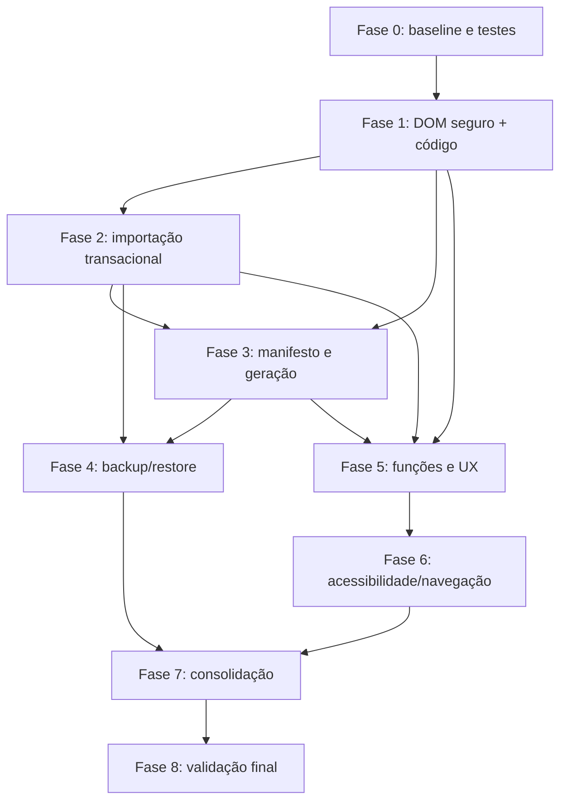

# Revisão crítica do plano de correção e implementação

**Data:** 23/09/2026  
**Documento-base:** `AUDITORIA_FUNCIONAL_2026-09-23.md`

## Parecer executivo

O plano original tem boa cobertura técnica, mas não deve ser executado na ordem atual. Ele coloca testes na fase 7, embora as primeiras fases alterem segurança, identidade dos alunos, persistência e arquivos. Isso aumenta o risco de corrigir um problema e quebrar geração, fotos ou PDF sem detecção imediata.

Também há propostas que precisam de uma decisão de produto antes do código:

- o sistema continuará estritamente local ou será usado na rede;
- a interface Tkinter continuará suportada ou será considerada legada;
- crachás gerados fazem parte do backup ou são artefatos reproduzíveis;
- a cor do modelo oficial pode ser alterada ou a opção deve ser removida;
- arquivos antigos devem ser apagados, arquivados ou apenas sinalizados.

A recomendação é tratar o sistema como uma aplicação local, com a interface web como principal, preservar a planilha e as fotos como fontes de verdade e usar o código do aluno como identidade em toda a cadeia.

## O que está correto no plano original

1. Coloca segurança de renderização, backup e integridade dos arquivos entre os problemas mais relevantes.
2. Relaciona cada problema a arquivo, correção e critério de aceite.
3. Evita exclusão automática de arquivos antigos.
4. Reconhece que nome não é identificador confiável.
5. Inclui validação final e reconciliação dos dados.
6. Separa problemas funcionais, UX, refatoração e testes.

## Fragilidades do plano original

### 1. Testes aparecem tarde demais

Os testes devem começar na fase zero e acompanhar cada incremento. XSS, mudança de identidade por código, importação transacional e manifesto de geração alteram contratos usados por quase toda a interface.

**Ajuste:** criar primeiro testes de caracterização dos fluxos que já funcionam e um E2E mínimo. Cada fase deve entregar seus próprios testes.

### 2. Segurança e identidade foram separadas

Eliminar `innerHTML` inseguro exige refazer linhas e controles dinâmicos. Alterar seleção e preview de nome para código também exige mexer nos mesmos templates e handlers.

**Ajuste:** executar DOM seguro e identidade por código na mesma fase. Assim o frontend é refeito uma vez.

### 3. O plano sugere CSP cedo, mas o frontend usa handlers inline

Uma CSP útil bloqueará `onclick`, `onchange` e estilos inline atuais. Ativá-la antes da migração interromperia quase toda a interface.

**Ajuste:** primeiro remover handlers inline e renderização insegura; depois ativar CSP em modo de relatório e, por último, em modo de bloqueio.

### 4. “Store por workspace/usuário” pode ser excesso de arquitetura

O sistema opera em localhost e manipula uma base pequena. Sessões multiusuário, banco e workspaces aumentariam custo sem necessidade comprovada.

**Ajuste:** persistir inicialmente somente um estado local controlado: caminho/hash da planilha ativa, data da importação e configuração operacional. Se houver uso em rede, abrir um projeto separado para autenticação, banco e isolamento por usuário.

### 5. Jobs/SSE para progresso podem ser desnecessários

O problema atual é um timer falso que vaza em erro. Um sistema de filas ou SSE adiciona concorrência, cancelamento e persistência de jobs.

**Ajuste:** usar progresso indeterminado e tempo decorrido. Implementar job assíncrono somente se medições mostrarem geração longa demais ou houver requisito real de cancelamento.

### 6. Aplicar “cor de destaque” pode violar o modelo oficial

O crachá utiliza arte institucional fixa. Recolorir áreas pode produzir um documento fora do padrão IEMA.

**Ajuste recomendado:** remover a opção de cor da web e do Tkinter. Só implementá-la caso exista especificação visual clara de quais pixels ou elementos podem mudar.

### 7. Backup de tudo pode ficar pesado e redundante

Os crachás e PDFs são derivados da planilha, fotos e configuração. Copiar todos os resultados em cada backup aumenta volume e tempo.

**Ajuste:** backup padrão deve incluir fontes de verdade; artefatos gerados devem ser opcionais. Todo backup deve ter manifesto, hashes e versão de formato.

### 8. Limpeza automática de saídas é arriscada

Comparar somente nome de arquivo pode marcar como obsoleto um crachá válido produzido por versão anterior ou com grafia diferente.

**Ajuste:** gerar manifesto por código e mover arquivos não reconhecidos para uma pasta de quarentena após ação explícita. Não apagar automaticamente.

### 9. O plano não trata adequadamente a importação como transação

“Separar estado pendente e confirmado” está correto, mas falta definir o contrato.

**Ajuste:** `/api/planilha/colunas` deve criar um `upload_id` pendente sem alterar a base ativa. Confirmar promove o upload; cancelar remove o temporário. Apenas um upload pendente deve existir por sessão local.

### 10. Interface desktop e CLI ficaram fora da execução

O plano original não decide se a interface Tkinter receberá as mesmas correções. Mantê-la parcialmente funcional duplica manutenção e pode continuar expondo backup e cor defeituosos.

**Ajuste recomendado:** declarar a web como interface oficial. Manter CLI para automação. Congelar/depreciar Tkinter ou reservar uma fase explícita para paridade e thread safety.

## Decisões arquiteturais recomendadas

| Tema | Decisão recomendada | Motivo |
|---|---|---|
| Implantação | Localhost por padrão e bloqueio explícito para host externo | Evita criar autenticação sem necessidade e impede exposição acidental |
| Identificador | Código do aluno em UI, API, manifesto e nomes técnicos | Evita ambiguidade e colisão por nome |
| Fonte de verdade | Planilha ativa + fotos + configuração | Permite reconstruir todos os artefatos |
| Persistência | Arquivo JSON de estado com caminho, hash e data | Solução suficiente para uso local e fácil de auditar |
| Saída | Manifesto por turma e arquivos associados ao código | Reconciliação determinística |
| Obsoletos | Sinalizar e arquivar mediante confirmação | Preserva dados e permite reversão |
| Backup | Essenciais por padrão; gerados opcionais | Menor volume e restauração clara |
| Cor | Remover até existir requisito institucional | Evita opção enganosa e alteração indevida do modelo |
| Progresso | Indeterminado com tempo decorrido | Resolve UX sem infraestrutura desnecessária |
| Interface | Web oficial; CLI suportada; Tkinter legado | Reduz três fluxos divergentes |

## Plano revisado

### Fase 0 — Proteção e linha de base

**Objetivo:** permitir mudanças seguras.

- Congelar uma cópia verificada de `alunosiema.xlsx`, `fotos_alunos` e configurações.
- Registrar hashes e contagens por turma.
- Criar testes de caracterização para carregar planilha, gerar um crachá, gerar uma turma, localizar foto e exportar PDF.
- Criar um E2E smoke test: carregar IEMA → filtrar turma → preview → gerar um aluno.
- Definir a interface web como principal e registrar o status de Tkinter/CLI.

**Aceite:** restauração manual testada, 42 testes atuais passando e smoke test executável.

### Fase 1 — Fronteira de confiança e identidade oficial

**Objetivo:** remover a vulnerabilidade e a ambiguidade sem alterar geração visual.

- Substituir templates de dados por construção DOM segura com `textContent`.
- Remover handlers dinâmicos inline.
- Usar código do aluno em checkboxes, preview, seleção e payloads.
- Validar código único no momento da importação, além da geração.
- Adicionar CSP inicialmente em modo `Report-Only`; ativar bloqueio depois de remover inline scripts.
- Bloquear inicialização em host externo sem configuração explícita.

**Aceite:** payloads HTML aparecem como texto; nomes duplicados funcionam; CSP não quebra fluxos; geração permanece idêntica.

### Fase 2 — Importação transacional e estado local

**Objetivo:** fazer Confirmar e Cancelar terem significado real.

- Preview retorna `upload_id` e não altera a base ativa.
- Confirmar promove o upload e grava metadados da planilha ativa.
- Cancelar remove o upload pendente e preserva a base anterior.
- Na inicialização, recarregar a planilha ativa somente se hash e caminho forem válidos.
- Mostrar claramente arquivo ativo, data e quantidade de alunos.

**Aceite:** cancelar não altera estado; reinício restaura a mesma base; arquivo modificado externamente gera aviso.

### Fase 3 — Integridade da geração

**Objetivo:** tornar a saída rastreável e reconciliável.

- Criar manifesto por turma com código, nome, hash da foto, QR, formato, versão do template e arquivo.
- Gerar nomes técnicos por código; manter nome somente como metadado visual.
- Produzir em diretório temporário e promover arquivos concluídos.
- Detectar faltantes, extras, duplicados e obsoletos.
- Oferecer “Arquivar obsoletos” com confirmação e relatório, sem exclusão automática.
- Corrigir a divergência atual da turma 102 após a rotina estar testada.

**Aceite:** cada código possui exatamente um resultado esperado por formato; falha parcial é explícita; nenhum arquivo é removido silenciosamente.

### Fase 4 — Backup e recuperação

**Objetivo:** proteger as fontes de verdade.

- Incluir planilha ativa, fotos, template, estado/configuração e manifestos.
- Permitir incluir crachás/PDFs como opção.
- Criar ZIP temporário e promover atomicamente.
- Incluir hashes, versão e inventário.
- Implementar restauração em pasta isolada, com validação e confirmação antes de substituir dados.

**Aceite:** restore isolado reproduz hashes e permite regenerar os crachás.

### Fase 5 — Correções funcionais e UX

**Objetivo:** remover controles quebrados e informações incorretas.

- Corrigir Preview da tela Gerar.
- Remover a configuração de cor, salvo requisito formal contrário.
- Trocar progresso simulado por estado indeterminado e limpar sempre no `finally`.
- Corrigir diagnóstico para usar planilha ativa, fotos, manifestos e `crachas_montados`.
- Corrigir dashboard para separar alunos ativos, arquivos gerados e alunos sem crachá.
- Tratar conflito no upload de fotos com substituir/ignorar e relatório.
- Só anunciar download após resposta válida.

**Aceite:** nenhum botão falha silenciosamente; números do dashboard reconciliam com o manifesto.

### Fase 6 — Acessibilidade e navegação

**Objetivo:** completar o uso por teclado e preservar contexto.

- Adicionar nomes acessíveis, `aria-expanded`, `aria-modal` e `role="dialog"`.
- Implementar ESC, foco inicial, focus trap e restauração.
- Ocultar inputs visualmente sem removê-los da navegação por teclado.
- Usar hash de URL para abas, solução suficiente para a SPA atual.
- Testar 320, 375, 768, 1024 e 1440 px.

**Aceite:** fluxos completos por TAB/ENTER/SPACE/ESC; voltar/recarregar preserva a aba.

### Fase 7 — Consolidação de código e interfaces legadas

**Objetivo:** reduzir manutenção e inconsistências.

- Remover definição duplicada de `_salvar_temporario`, imports e campos mortos.
- Centralizar versão.
- Atualizar README e contagens.
- Se Tkinter for mantido, corrigir atualizações fora da thread principal e alinhar funcionalidades essenciais.
- Se for descontinuado, sinalizar claramente e retirar do fluxo recomendado.

**Aceite:** lint limpo, versão única e documentação compatível com o produto entregue.

### Fase 8 — Validação de liberação

**Objetivo:** comprovar o resultado.

- Executar testes unitários, integração, contratos e E2E em viewport desktop/mobile.
- Reexecutar auditoria dos 45 padrões de interação.
- Testar backup/restore e reconciliação em cópia isolada.
- Validar uma turma completa: código, nome, foto, QR, PNG e PDF.

**Aceite:** zero controles quebrados, zero arquivos órfãos não explicados, backup restaurável e todos os testes críticos aprovados.

## Dependências entre fases

## Estimativa relativa

| Fase | Esforço relativo | Risco de regressão |
|---|---:|---:|
| 0 — baseline | Pequeno | Baixo |
| 1 — segurança/identidade | Médio | Alto |
| 2 — importação/estado | Médio | Alto |
| 3 — integridade de geração | Grande | Alto |
| 4 — backup/restore | Médio | Alto |
| 5 — funções/UX | Médio | Médio |
| 6 — acessibilidade/navegação | Médio | Médio |
| 7 — consolidação | Pequeno/Médio | Médio |
| 8 — validação | Médio | Baixo |

Para uma pessoa trabalhando de forma contínua, a ordem de grandeza é de **8 a 13 dias úteis**, sem incluir autenticação multiusuário nem reescrita do Tkinter. Essa estimativa depende principalmente da migração de identidade, manifesto e restore.

## Recorte mínimo recomendado

Se for necessário entregar valor rapidamente, o primeiro pacote deve conter:

1. testes de caracterização;
2. DOM seguro;
3. identificação por código;
4. Preview e Cancelar corrigidos;
5. remoção da cor sem efeito;
6. dashboard/diagnóstico corretos;
7. backup das fontes de verdade;
8. manifesto e relatório de divergências, ainda sem limpeza automática.

Esse pacote elimina os riscos mais relevantes sem introduzir banco, fila, SSE ou autenticação que o cenário local ainda não exige.

## Conclusão crítica

O plano original deve ser mantido como inventário de necessidades, mas substituído por esta sequência para implementação. A mudança mais importante é colocar testes e decisões arquiteturais antes das correções, combinar segurança com identidade por código e evitar soluções maiores que o contexto local.

O maior risco técnico não está em um botão isolado. Está na ausência de uma identidade única atravessando planilha, UI, fotos, crachás, QR, manifesto e backup. Corrigir essa cadeia primeiro reduz simultaneamente problemas de segurança, colisão, reconciliação e rastreabilidade.
